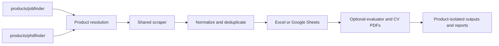

# Architecture

This repository is a two-product Python application:

- **JobFinder** searches general employment opportunities.
- **PhDFinder** searches PhD and academic-research opportunities.

They are separate products at the configuration, state, command, workflow, and
output boundaries. They intentionally share one engine.

## System shape



The internal keys `jobs` and `phd` are selected by `--product` and
`JOBFINDER_PRODUCT`. The older `--profile` and `JOBFINDER_PROFILE` forms remain
accepted for compatibility. Canonical product definitions live in
`src/jobfinder/products.py`; `src/jobfinder/profiles.py` is only a compatibility
facade.

## Repository ownership

```text
products/
  jobfinder/               # JobFinder filters and evaluator examples
  phdfinder/               # PhDFinder filters and evaluator examples
src/jobfinder/
  core/                    # cross-cutting runtime helpers
  providers/               # provider adapters and Apify execution
  scraper/                 # search, filters, exports, and history
  dedupe/                  # deterministic matching and merging
  evaluator/               # OpenAI evaluation and CV PDF output
  spreadsheet/             # shared column contracts
  pipeline/                # product-aware orchestration and preflight
  integrations/google/     # Google credentials, Sheets, and Drive
  operations/              # reports and CI runtime-file preparation
tests/                     # network-free behavior and isolation tests
```

## Product boundary

Each product owns:

- Search keywords and filters
- Evaluator prompt and Master CV
- Optional CV photo
- Local Excel filename
- Google spreadsheet ID and historical seen-job state
- Generated-CV Drive folder
- Workflow concurrency, reports, and artifacts

The engine may receive a `FinderProduct`, but shared provider, dedupe, and
integration modules must not import product-specific files directly.

## Shared-engine boundaries

| Module | Owns | Must not own |
|---|---|---|
| `products.py` | Product paths, labels, and isolated settings | Scraping or evaluation behavior |
| `providers` | Actor payloads, actor output normalization, Apify execution | Final filters or spreadsheet formatting |
| `scraper` | Search planning, filtering, export, and history | Evaluator prompts or CV generation |
| `dedupe` | Pure identity, scoring, and canonical merging | External API calls |
| `evaluator` | Prompting, response parsing, storage updates, and PDFs | Provider schemas |
| `spreadsheet` | Column contracts | Storage API calls |
| `pipeline` | Product-aware orchestration, preflight, and resume | Provider implementation details |
| `integrations` | External API adapters | Product policy |
| `operations` | Sanitized reports and ephemeral CI files | Long-lived product state |

## Runtime flow

1. Resolve JobFinder or PhDFinder from the command default, `--product`, or
   `JOBFINDER_PRODUCT` (with the historical profile forms as fallbacks).
2. Load that product's private keywords and committed filters.
3. Build provider searches and run Apify actors.
4. Normalize provider output and deterministically merge duplicates.
5. Apply final product filters.
6. Remove already-seen jobs using only that product's spreadsheet history.
7. Export a timestamped sheet or local workbook.
8. Optionally evaluate pending rows and generate tailored CV PDFs.
9. Write sanitized operational reports for the same product workflow.

## Workflow design

`.github/workflows/jobfinder.yml` and `.github/workflows/phd.yml` keep product
schedules, environments, inputs, artifact names, and concurrency separate.
Both call `jobfinder.operations.runtime_files` to validate secrets and
materialize private files using the same tested rules.

Operational success is not inferred only from the GitHub Actions conclusion.
The workflow preserves scraper reports, `failed_sources`, `unique_job_count`,
and logs so provider failures remain diagnosable.

## Compatibility policy

The installed commands are canonical:

- `jobfinder`
- `phdfinder`
- `jobfinder-scrape`
- `jobfinder-evaluate`
- `jobfinder-pipeline`

Historical Python imports under `jobfinder.profiles`, `jobfinder.google_*`, and
`jobfinder.scraper.providers.*` remain compatibility facades. New code must use
`jobfinder.products`, `jobfinder.integrations.google`, and
`jobfinder.providers`.

Compatibility facades may be removed only after repository tests, docs, and a
published deprecation window show no remaining usage.

## Growth rules

- Add a third product through `products.py` plus a symmetric `products/<slug>/`
  tree; never copy the engine.
- Add providers through `ProviderAdapter` and `providers/registry.py`.
- Start spreadsheet changes in `spreadsheet/schema.py`.
- Keep secrets and generated files ignored and product-scoped.
- Keep CI preparation manifest-scoped so cleanup cannot delete unrelated files.
- Split orchestration-heavy modules only with behavior tests around incremental
  saves, history identity, and failure reports.
