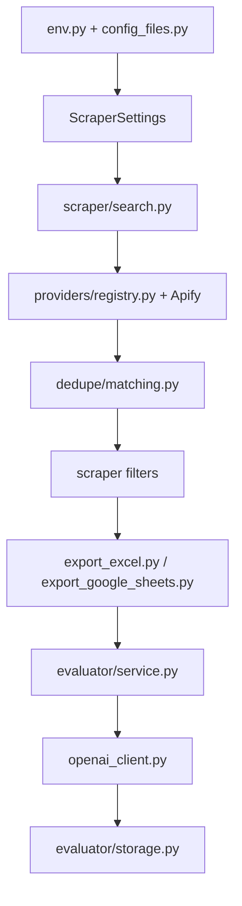

# `jobfinder` Package

This package is the shared production engine behind JobFinder and PhDFinder.
Product-owned inputs live under `products/`; reusable behavior lives here.
New code should import from `jobfinder.*`.

## Table Of Contents

- [Prerequisites](#prerequisites)
- [Quick Start](#quick-start)
- [Use This For Your Own Project](#use-this-for-your-own-project)
- [Package Map](#package-map)
- [Runtime Entry Points](#runtime-entry-points)
- [Architecture Boundaries](#architecture-boundaries)
- [Data Flow](#data-flow)
- [Design Constraints](#design-constraints)
- [Extension Points](#extension-points)
- [Troubleshooting](#troubleshooting)

## Prerequisites

- Python 3.14 or newer.
- Runtime dependencies installed with `python -m pip install -e ".[all]"`.
- Private files and credentials only for commands that actually scrape,
  evaluate, or touch Google APIs.

## Quick Start

From the repository root:

```bash
python -m pip install -e ".[all]"
jobfinder-pipeline --help
jobfinder-scrape --help
jobfinder-evaluate --help
```

Without installing the package, set `PYTHONPATH` for direct module execution:

```bash
env PYTHONPATH=src python -m jobfinder.pipeline.cli --help
```

## Use This For Your Own Project

Forks should usually change configuration and private inputs before package
code:

| Need | Start with |
|---|---|
| Search terms | `products/jobfinder/config/keywords.txt` or `JOB_KEYWORDS_TEXT`. |
| Search geography and filters | `products/jobfinder/config/filters.json` plus provider env vars. |
| Runtime mode, secrets, and tuning | `.env` locally or `.github/workflows/jobfinder.yml` in Actions. |
| Prompt and CV behavior | `products/jobfinder/evaluator/master_prompt.txt`, `products/jobfinder/evaluator/master_cv.tex`, and evaluator settings. |
| New provider or output columns | Package modules listed in [Extension Points](#extension-points). |

Keep compatibility import facades thin. New behavior belongs in the canonical
modules under `src/jobfinder`.

## Package Map

| Path | Responsibility |
|---|---|
| `config_files.py` | Loads `products/jobfinder/config/keywords.txt` and `products/jobfinder/config/filters.json` and provides typed config helpers. |
| `env.py` | Reads real environment variables with `.env` fallback. Real env values win. |
| `paths.py` | Central repository-relative file paths. |
| `core/` | Shared runtime helpers such as CLI logging setup. |
| `integrations/google/` | Google credential resolution, API client helpers, Sheets, and Drive adapters. |
| `google_config.py`, `google_auth.py`, `google_sheets.py`, `google_drive.py` | Compatibility facades for existing imports. |
| `providers/` | Stable provider adapter surface, Apify client, provider registry, actor payloads, and actor-output normalization. |
| `scraper/` | Scraper settings, search execution, dedupe handoff, filters, exports, and Google Sheets history. |
| `dedupe/` | Deterministic cross-provider duplicate detection and canonical merge logic. |
| `evaluator/` | OpenAI job-fit evaluation, CV PDF generation, parsing, storage adapters, and final cleanup. |
| `pipeline/` | One-step scrape/evaluate CLI and preflight checks. |
| `spreadsheet/` | Canonical spreadsheet column contracts shared by scraper and evaluator. |
| `operations/` | Sanitized reports and shared CI runtime-file preparation. |
| `products.py` | Canonical JobFinder/PhDFinder product definitions and isolated paths. |
| `profiles.py` | Compatibility facade for historical profile imports. |

## Runtime Entry Points

| Console script | Module | Purpose |
|---|---|---|
| `jobfinder` / `jobfinder-pipeline` | `jobfinder.pipeline.cli:main` | Run JobFinder. |
| `phdfinder` | `jobfinder.pipeline.cli:phd_main` | Run PhDFinder. |
| `jobfinder-scrape` | `jobfinder.scraper.cli:main` | Run only the shared scraper. |
| `jobfinder-evaluate` | `jobfinder.evaluator.cli:main` | Evaluate an existing output. |

Without `python -m pip install -e ".[all]"`, direct module execution requires:

```bash
env PYTHONPATH=src python -m jobfinder.pipeline.cli --help
```


## Architecture Boundaries

The package is intentionally split into services and pure helpers:

- CLI modules parse user input, configure logging, convert exceptions into
  process exit codes, and write optional JSON reports.
- Service modules orchestrate workflow steps and are easier to test directly.
- Provider modules translate between JobFinder settings and external actor
  schemas. `providers/registry.py` is the adapter table used by scraper
  orchestration.
- Storage modules isolate Excel and Google Sheets APIs.
- `spreadsheet/schema.py` is the shared contract. Scraper and evaluator should
  not invent independent column lists.

## Data Flow



## Design Constraints

- Keep secrets out of repository files. Private runtime files are ignored by
  `.gitignore`.
- Preserve spreadsheet column names unless downstream docs and tests are updated
  with the change.
- Prefer deterministic parsing and matching over AI for scraper and dedupe
  behavior.
- Avoid provider-specific fields leaking into spreadsheet columns. Provider
  metadata should be internal unless deliberately promoted into
  `spreadsheet/schema.py`.
- Keep service functions usable outside the CLI; tests depend on that boundary.

## Extension Points

Common changes and where they belong:

| Change | Start here |
|---|---|
| Add a provider | `providers/`, `scraper/search.py`, `scraper/settings.py`, provider tests. |
| Change output columns | `spreadsheet/schema.py`, exporters, evaluator parsing/storage, docs, tests. |
| Tune dedupe identity | `dedupe/normalize.py`, `dedupe/scoring.py`, `dedupe/matching.py`, `tests/dedupe/test_matching.py`. |
| Change evaluator output parsing | `evaluator/parsing.py`, `evaluator/models.py`, evaluator tests. |
| Change production scheduling | `.github/workflows/jobfinder.yml` and `.github/workflows/README.md`. |

## Troubleshooting

| Problem | What to check |
|---|---|
| `No module named 'jobfinder'` | Run from the repository root, install with `python -m pip install -e ".[all]"`, or set `PYTHONPATH=src`. |
| Console script is missing | Reinstall the editable package after changing `pyproject.toml`. |
| A compatibility import behaves differently | Compare the facade module with the stable `jobfinder.*` implementation it re-exports. |
| A column change breaks evaluator output | Update `spreadsheet/schema.py`, exporter/evaluator code, tests, and READMEs together. |
